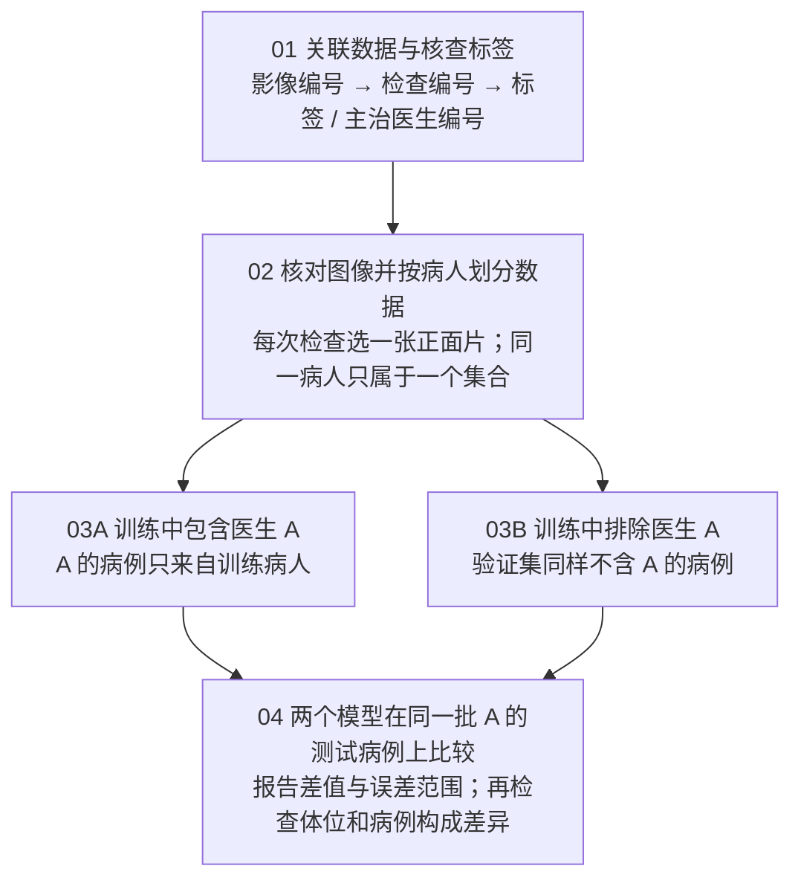

# 换一位阅片医生，胸片模型还能保持表现吗？

BN5212 / 合作者讨论稿 / 2026-09-08 / v1.0

[PDF 版](BN5212_Idea1_Team_Brief.pdf) · [当前交接](../HANDOFF.md) · [持续更新的实验资料](PROJECT.md)

本文是同名 PDF 的可编辑版本，保留原稿的五部分内容。原稿中的本地文件大小、磁盘余量和设备配置是核查时的快照；正式实验设置以持续更新的实验资料为准。PDF 入库时修正了单位上标的显示。

Idea 1：用标准图像分类模型，检验报告来源标签的跨医生适应能力。

**当前状态：**数据索引、报告和医生表已核查；真实胸片尚未下载。数据下载等待后续通知。本稿提供实验设计与资源预算，尚无模型准确率或跨医生性能结果。

## 1. 数据与标签

### 数据够不够接起来？

| 对象 | 本次核查结果 | 应如何理解 |
| --- | --- | --- |
| 课程影像子集 | 5,534 张 / 3,351 次检查 / 1,000 位病人 | 来自现有 ZIP 索引，影像像素未复核 |
| 主治医生 | 3,351 次检查都有编号；共 35 位 | 匿名编号可用于分组，不是医生真实姓名 |
| 住院医医生 | 1,211 次检查有编号；共 92 位 | 报告可能涉及多位医生，主治不是必然唯一作者 |
| 现有标签 | 3,351 次检查均关联到自定义标签行 | 来自报告文本抽取，尚未充分验证 |

### 标签是“报告里怎么写”，不是独立影像复核

同一次检查可能包含正面和侧面片，通常共用一份报告。标签属于检查级；医生表记录该检查关联的医生，不能等同于独立专家复核标签。[1]

| 肺不张原始标签 | 阳性 | 明确阴性 | 不确定 | 未提及 |
| --- | --- | --- | --- | --- |
| 课程子集检查数 | 832 | 13 | 213 | 2,293 |

**拟定第一版规则：**阳性记为 1；明确阴性与未提及记为 0；不确定先排除。因此目标是“报告是否明确报出肺不张”，0 不代表医学上确定无病。标签表缺少整行时必须单独排除，不能当成未提及。

正式实验优先核对并使用官方 CheXpert 标签；当前本地未找到该文件。官方标签同样来自报告，不是独立影像金标准。上述计数仅描述现有自定义标签。[2]

## 2. 实验设计：两个模型，考同一套题

示例：在相同的 A 医生测试病例上，比较训练时是否见过 A 的其他病例。



### 把可能混淆结果的因素控制住

| 安排 | 具体做法 |
| --- | --- |
| 病人完全隔离 | 先按病人划分训练 / 验证 / 测试集。不能把同一病人的复查片分到两边。 |
| 训练规模可比 | 两组匹配训练数量，尽量平衡 AP/PA；确保包含 A 的组确实保留 A 的训练病例。 |
| 验证规则一致 | 两模型使用同一个不含 A 的验证集、相同模型和训练设置；不在测试集选参数或阈值。 |
| 避免挑选结果 | 先规定医生纳入条件和随机种子。测试正负例病人数太少时报告无法稳定估计。 |

**主要输出：**每位医生的测试病人数、阳性比例、AUROC、AUPRC、Brier 分数，以及两个模型的差值。按病人配对重复抽样计算 95% 置信区间。AUROC 看排序能力，AUPRC 更关注阳性识别，Brier 看概率预测误差。

**解释边界：**若表现下降，先说明对该医生关联病例的适应能力有限。重症比例、拍摄体位和报告抽取误差也可能造成变化；不能直接宣称模型只学会了医生习惯。

## 3. 实现草图：函数与主流程伪代码

以下用于队内对齐任务与接口，尚未实现或运行真实胸片训练。代码包含说明性中文，不能直接运行；图像处理仍须等待通知。

```text
def build_manifest(image_index, labels, providers):
    data = 按影像编号关联检查，再按检查编号关联标签与医生
    核查重复、关联失败；保留病人编号、原标签和标签来源
    return data

def define_target(data):
    排除标签整行缺失；不确定标签先排除
    阳性 -> 1；明确阴性或未提及 -> 0
    保存原始四态标签，便于后续更换处理规则
    return data, 排除记录

def prepare_images(data):
    读取完整 DICOM，核对体位并检查灰度转换
    按固定规则每次检查选一张正面片，统一尺寸并抽查图像
    return image_dataset

def split_by_patient(data, seed):
    train, valid, test = 按病人划分(data, seed)
    assert 三组没有共同病人或重复影像
    return train, valid, test

def make_reader_pair(train, valid, test, doctor):
    test_A = test[主治医生 == doctor]
    valid_common = valid[主治医生 != doctor]
    unseen = train[主治医生 != doctor]
    seen = train  # 保留该医生在训练病人中的病例
    seen, unseen = 匹配数量并检查体位构成(seen, unseen)
    检查测试正负例及独立病人数；不足时停止该医生比较
    return seen, unseen, valid_common, test_A

def train_model(train, valid, seed):
    model = ImageNet预训练ResNet18(输出一个概率)
    仅输入胸片像素；用验证集选模型与阈值
    return 训练得到的model

def run_idea1(config):
    data = build_manifest(影像索引, 标签表, 医生表)
    data, audit = define_target(data)
    data = prepare_images(data)
    train, valid, test = split_by_patient(data, config.split_seed)
    for doctor in 按预设条件纳入的医生:
        seen, unseen, val, test_A = make_reader_pair(train, valid, test, doctor)
        for seed in config.training_seeds:
            m1 = train_model(seen, val, seed)
            保存m1在test_A的概率预测，然后释放m1的显存
            m2 = train_model(unseen, val, seed)
            保存m2在test_A的概率预测，然后释放m2的显存
            按病人配对比较两组预测，保存指标差值及置信区间
    return 汇总表, 标签核查记录, 病人划分清单
```

医生编号用于分组，不作为模型输入。多个医生或随机种子的实验依次运行，训练次数增加会延长耗时，但不要求把所有模型同时放入显存。

## 4. 资源预算：硬盘

### 原始文件大，训练副本可以小很多

以下范围对应课程 5,534 张影像，不是 MIMIC-CXR 全量 377,110 张影像。

| 项目 | 大小 | 依据与状态 |
| --- | --- | --- |
| dataset.zip | 约 43.34 GB（40.36 GiB） | 现有 ZIP 索引估算；包括文件头和目录后会略增 |
| 全部 DICOM 解压 | 75.44 GB（70.26 GiB） | 索引中未压缩成员大小求和；未实际解压 |
| ZIP + 全部解压副本 | 约 118.78 GB | 尚未计入训练副本、模型及临时文件 |
| 现有本地表格与报告 | 约 3.93 GB | 本地文件统计；包含主实验不一定使用的住院资料 |

### 固定尺寸灰度副本：可以直接计算的参考值

| 保存规格 | 保留全部 5,534 张 | 每检查一张：最多 3,351 张 |
| --- | --- | --- |
| 224 × 224 / 单通道 / 8-bit | 0.278 GB | 0.168 GB |
| 512 × 512 / 单通道 / 8-bit | 1.451 GB | 0.878 GB |
| 1,024 × 1,024 / 单通道 / 8-bit | 5.803 GB | 3.514 GB |

公式：图片数 × 高 × 宽 × 每像素 1 字节。表中为未压缩像素量，不含文件头；PNG/JPEG 的实际大小取决于图像内容与压缩设置。最终能保留多少正面片，须等完整体位信息核查后确定。

### 建议的硬盘安排

**省空间路线：**保留一份 ZIP，逐个成员解码并转换成训练副本，避免生成完整 DICOM 解压副本。主模型只保留最佳权重与预测结果。建议为该流程准备 **55-65 GB** 空间。

**完整解压路线：**ZIP、DICOM 和训练副本都保留，建议准备 **135-150 GB** 空间。本机核查时约余 97.2 GB，容不下完整双份原始数据。

模型磁盘预算：单个二分类 ResNet-18 的 FP32 参数约 44.7 MB。两模型 × 医生数 K × 随机种子数 S，权重约为 `0.089 × K × S GB`；例如 K=10、S=3，约 2.7 GB。保存优化器状态约再增两份参数量。

**单位说明：**本页 GB = `10^9` 字节；GiB = `2^30` 字节。Dropbox 显示约 40.36 GB 的 ZIP，与这里约 43.34 GB 的估算主要是单位口径不同。

## 5. 资源预算：显存

### 现有 6 GB 显卡适合先做小规模试验

已在本机 RTX 3060 Laptop GPU 上做短时随机数据测试；不是实际胸片训练结果。

| 输入尺寸 | 每批图片数 | 张量峰值 GiB | 框架保留峰值 GiB |
| --- | --- | --- | --- |
| 224 × 224 | 8 | 0.28 | 0.32 |
| 224 × 224 | 16 | 0.46 | 0.54 |
| 224 × 224 | 32 | 0.64 | 0.82 |
| 512 × 512 | 8 | 0.76 | 0.89 |
| 512 × 512 | 16 | 1.25 | 1.58 |

**测试设置：**ResNet-18、单输出、全部参数更新、AdamW、AMP 混合精度，每个设置运行 3 个完整更新步。输入为随机三通道张量；随机初始化，不下载权重。PyTorch 2.12.0+cu126，torchvision 0.27.0+cu126。

“张量峰值”是模型与中间计算实际分配的显存；“框架保留峰值”还包括缓存。两者都不是整张显卡的全部占用，系统显示、CUDA 运行环境和其他应用也会占空间。[3,4]

### 给正式试验留出余量

| 建议设置 | 给训练进程预留的显存预算 | 用途 |
| --- | --- | --- |
| 224 × 224，batch 16，AMP | 约 2 GiB | 先检查整个流程能否正常工作 |
| 512 × 512，batch 8-16，AMP | 约 3-4 GiB | 检查更高分辨率下结论是否一致 |

上述预算是保守估算，不是硬性上限；正式训练还取决于数据增强和实现方式。两模型依次训练并释放显存，避免同时驻留。6 GB 显卡应有余量，无需先租云端 GPU。电脑内存约 15.3 GiB，读取图像时按批加载即可。

### 真实胸片训练前，还要完成什么？

1. 核对官方标签与现有抽取误差。
2. 重新读取完整 DICOM 头：当前仅 1,893 / 5,534 张有体位值。
3. 查看每位医生在测试集中有多少独立阳性和阴性病人。
4. 抽查图像转换效果，再冻结划分与标签规则。

### 本稿依据与复核说明

1. [MIMIC-CXR v2.1.0](https://physionet.org/content/mimic-cxr/2.1.0/)：检查、报告和匿名医生编号的对应关系。
2. [MIMIC-CXR-JPG v2.1.0](https://physionet.org/content/mimic-cxr-jpg/2.1.0/)：报告标签的生成及四态定义。
3. [PyTorch AMP examples](https://docs.pytorch.org/docs/2.14/notes/amp_examples.html)。
4. [PyTorch peak memory API](https://docs.pytorch.org/docs/2.14/generated/torch.cuda.memory.max_memory_allocated.html)。

本地证据：课程 ZIP 索引、影像子集清单、provider 表、report_labels 表及资源测试 JSON。公开说明用于核对语义；计数与显存来自本地复核。核查日期：2026-09-08。
