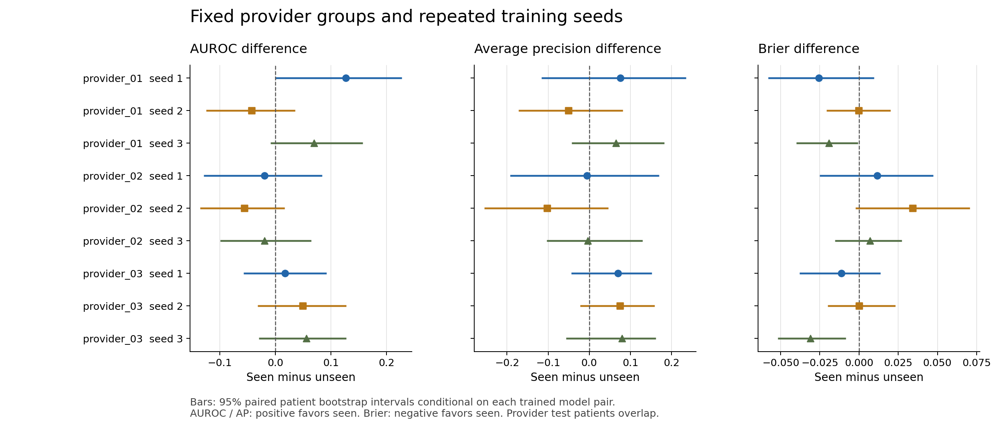

# 期末扩展实验报告

更新：2026-10-08。本报告只讨论已完成的胸片肺不张识别实验。精确数值以 [results.json](results.json) 为准，实验设置见 [protocol.json](protocol.json)，结构核查见 [audit.json](audit.json)，执行核查见 [verification.json](verification.json)。

## 研究问题与结论

我们问：针对一位医生**关联**的病例，训练集中包含该医生关联病例的图像模型（seen），与训练时排除这些病例的模型（unseen），在同一批目标病例上的表现是否不同？医生编号只用于分组，不进入模型，也不代表逐图独立诊断者。

在预先选定的 3 个医生关联组和 3 个固定训练种子上，共训练 18 个 ImageNet 预训练 ResNet18 模型。三个组的平均测试 AUROC 差值（seen−unseen）分别为 **+0.051、−0.032、+0.041**。9 次单独配对比较的病人 bootstrap 95% 区间全部包含 0；第一组差值方向还会随训练种子改变。因此，本实验**没有提供可靠的普遍纳入增益证据**。这不证明两组等效，也不能推断医生水平或医生的因果作用。

## 数据、标签与模型

课程子集的冻结报告标签覆盖 3,351 次检查；按原有规则筛选后，研究队列包含 2,904 次可用检查。既有人工工作覆盖 272 条判定，51 条按统一规则协调调整；本轮新增人工或专家影像复核均为 0。标签来自放射学报告，不是独立影像金标准；报告未提及被操作性地当作阴性，不表示医学上确定无病。

每次检查固定选取一张正面胸片，先按病人隔离训练、验证和测试。ResNet18 的输入只有处理后的 224×224 胸片；报告文本只用于生成标签，医生编号只用于构造比较。三个医生组在看测试结果之前依可用规模纳入。每个目标组的 seen/unseen 训练集检查数、标签和体位分布相同，共用该组的验证与测试病例；其他临床病例构成未完全匹配。

| 匿名组 | 每个模型训练检查 | 共享验证检查 | 相同测试检查 / 病人 | seen 中目标医生检查 |
| --- | ---: | ---: | ---: | ---: |
| provider_01 | 1,409 | 477 | 109 / 55 | 249 |
| provider_02 | 1,412 | 475 | 90 / 49 | 246 |
| provider_03 | 1,472 | 485 | 110 / 51 | 186 |

训练采用固定配对抽样种子及 3 个训练种子（20260927、20260928、20260929），各训练 5 轮、batch 32、AdamW 学习率与 weight decay 均为 1e-4，以共享验证集 BCE 选择检查点。训练清单跨种子不重抽；不能依据测试表现挑医生、种子或模型设置。

## 测试结果

下表均值、样本标准差和范围来自每组 3 次训练，只描述这 3 个种子的观察值。它们**不是**覆盖训练随机性的置信区间。

| 组 | seen AUROC 均值 | unseen AUROC 均值 | 差值均值 | 差值标准差 | 差值范围 |
| --- | ---: | ---: | ---: | ---: | --- |
| provider_01 | 0.683 | 0.631 | +0.051 | 0.086 | [-0.042, +0.127] |
| provider_02 | 0.735 | 0.766 | -0.032 | 0.021 | [-0.056, -0.019] |
| provider_03 | 0.712 | 0.671 | +0.041 | 0.020 | [+0.018, +0.056] |

AUROC 衡量跨阈值的阳阴性排序能力，**不是正确率**。平均精确率 AP 衡量精确率与召回率的整体关系；结果文件中的 `AUPRC` 字段实际使用 average precision 算法。Brier 为概率预测的均方误差。AUROC/AP 越高越好，Brier 越低越好。次要指标的 seen−unseen 跨种子平均差值如下；其方向也随组别而变。

| 组 | AP 差值均值 | Brier 差值均值 |
| --- | ---: | ---: |
| provider_01 | +0.030 | -0.015 |
| provider_02 | -0.037 | +0.018 |
| provider_03 | +0.075 | -0.014 |

每次 seen/unseen 比较在同一测试病人上做 1,000 次配对病人 bootstrap，区间仅刻画**已训练好该模型对**时测试病人抽样的不确定性，不包含重新训练的随机性。9 个 AUROC 区间均包含 0；没有做多重比较校正，也没有将三个医生组合成一个独立总体区间。常数预测基线只使用训练阳性率，不读取图像；它不是一个强模型架构对照。

## 已执行的核查

- 2,522 张所需图像缓存完成；源标签、队列及清单哈希与冻结协议一致，病人隔离及标签/体位匹配通过。
- 9 次模型对的预测行与各自测试清单对齐，AUROC、AP、Brier 均独立重算一致。
- 18 份权重严格加载，并对每份模型的完整测试集重新推理；与保存预测的最大绝对差均为 0。权重未进入公开仓库，校验值见 [verification.json](verification.json)。
- 结构审计核对标签、检查和影像头关联。跨医生测试病人两两交集为 23、27、27 位；不能把三组或三个种子当作新增独立病人。

## 解释边界与后续研究

这是在已用于期中试验的病人划分上做的扩展复测，不是新的外部验证。训练组虽然按标签和体位匹配，病人重复检查、设备厂商及临床严重程度仍可能不同。报告标签也可能偏离影像真实状态。因而差值不能归因于医生，也不能用于临床部署或评价医生。

下一位研究接手者可先复核[模型说明](MODEL_CARD.md)和[代码入口](../../code/README.md)，再决定是否开展独立影像标签验证、外部病人队列测试或更广的医生/种子敏感性分析。任何新增运行应另立版本，保持当前测试结果与发布校验值不变。克隆仓库可检查方法、汇总图表和指标；完整重跑仍需获准访问私有标签、病例清单、影像与训练缓存。
