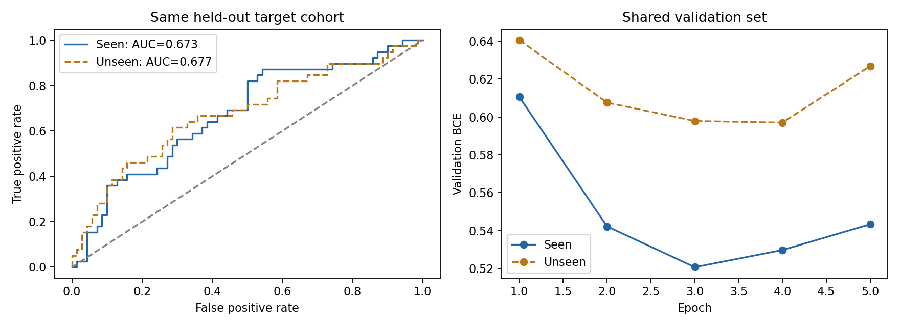

# 期中第一版 · 结果与接手材料

2026-09-27 的真实实验已完成。**同学制作 PPT 从这里开始，无需重新训练或下载胸片。** 本文件夹只发布汇总结果；正式 PPT 尚待小组制作。

## 文件怎么用

| 文件 | 用途 |
| --- | --- |
| [PRESENTATION_NOTES.md](PRESENTATION_NOTES.md) | 7 分钟讲述顺序、方法、结果表与限制，可直接据此制作 slides |
| [results.png](results.png) | 可直接插入 PPT 的 ROC 曲线和验证损失曲线 |
| [results.json](results.json) | 完整精度的测试指标、差值区间和逐轮训练记录；history 中指标属于验证集 |
| [summary.json](summary.json) | 标签计数、样本规模、体位分布及规则调整计数 |
| [run_config.json](run_config.json) | 模型、超参数、随机种子和私有划分文件的校验值 |
| [environment.json](environment.json) | 实际运行的软件版本 |
| [verification.json](verification.json) | 原运行的核查记录与文件哈希；local_commit 指原本地实验版本，不是发布提交 |
| [SHA256SUMS.txt](SHA256SUMS.txt) | 本文件夹公开文件的下载完整性校验值（不包含它自身） |
| [models/README.md](models/README.md) | 两份模型的大小、校验值和本机位置；权重不在公开 GitHub 中 |

代码保留在统一的 [code/](../../code/README.md)，详细研究记录见 [PROJECT.md](../../docs/PROJECT.md)。不要把旧记录中的每组 1,409 次计划误写成已完成的训练规模。

## 本次究竟做了什么

同一个 ImageNet 预训练 **ResNet18 图像分类模型**，分别用“包含目标医生关联病例”和“排除目标医生关联病例”的训练集微调。模型输入胸片，输出肺不张标签的预测分数；文本报告用于制作训练和评价标签，不作为 ResNet 输入。医生编号只用于分组，不是模型输入，也不能据此评价医生水平。

四人已完成 222 条分歧和 50 条一致样本判定，随后按小组规则保守协调。51 条人工判定经规则调整，原判定保留本机；未新增专家影像复核。报告标签不是独立影像金标准，未提及按 0 处理不代表医学上确定无病。

| 集合 | 检查数 | 独立病人数 | 阳性检查数 |
| --- | ---: | ---: | ---: |
| seen：包含目标医生的训练组 | 256 | 167 | 59 |
| unseen：排除目标医生的训练组 | 256 | 171 | 59 |
| 共享验证集 | 128 | 85 | 26 |
| 同一测试集 | 109 | 55 | 39 |

每次检查一张正面片，训练/验证/测试病人隔离；两训练组均为 PA 110、AP 146，但独立病人数未强制匹配。训练组之间允许共享部分病例，二者均不能与验证/测试病人交叉。seen 含目标医生 46 次训练检查，unseen 为 0；验证集排除该医生病例。每组训练 5 轮，仅按共享验证 BCE 选模型，分别选中第 3 / 4 轮。

## PPT 中可以使用的结果

| 指标 | seen | unseen | seen−unseen | 差值的病人配对 95% 区间 |
| --- | ---: | ---: | ---: | --- |
| AUROC ↑ | 0.673 | 0.677 | -0.004 | [-0.080, 0.060] |
| AUPRC ↑ | 0.511 | 0.573 | -0.062 | [-0.167, 0.074] |
| Brier ↓ | 0.222 | 0.219 | +0.003 | [-0.034, 0.042] |

**可用结论：我们已完成一次真实配对实验；当前小规模结果没有提供稳定的组间差异证据。** 区间来自 1,000 次病人配对 bootstrap，未覆盖重新训练随机性。不能写成“两组完全一样”“医生没有影响”或“准确率 67%”。



- AUROC 看模型把阳性排在阴性前面的总体能力，越高越好；它不是正确率，也不能单独说明假阳性或假阴性有多少。
- AUPRC 反映不同阈值下查准率和召回率的关系，越高越好。本测试集阳性比例为 39/109，约 0.358。
- Brier 衡量预测概率与标签的均方误差，越低越好。
- 假阳性是把标签为阴性的样本判成阳性，假阴性相反；具体比例需要先指定判定阈值。本版未报告阈值下的混淆矩阵，不要自行从 AUROC 推算。

## 同学接下来做什么

1. 依照讲述稿制作正式可编辑 PPT，包含问题与动机、相关工作、方法、当前进展与结果、限制和期末计划。
2. 将结果图及上述表格插入 PPT，统一 seen/unseen 的中文含义和差值方向。
3. 四位成员自行确认分工，四人都须发言，合计 7 分钟；现有讲述稿的分段时间合计 420 秒。
4. 确认实际汇报日期，最晚提前一天由一位成员在 Canvas 提交。具体日期仍待课程安排。
5. 可编辑 PPT 与提交版 PDF 放到仓库 `slides/`，通过 PR 提交。要求依据见 [slides/README.md](../../slides/README.md)。

本阶段不需要为追求更高指标重跑或改选测试集。期末再考虑多医生、多种子、扩大样本及标签验证。

## 下载与复现范围

```bash
git clone https://github.com/Grayye123/BN5212_group.git
cd BN5212_group
```

打开 `results/midterm_v1/README.md` 即可接手；也可在 GitHub 直接浏览文件。已有本地仓库的同学先保存自己的改动，再切换 main 并执行 `git pull --ff-only origin main`。

克隆即可取得本页列出的公开材料，但不包含原始影像、报告、逐病例标签/划分/预测、标注工作簿或训练权重。完整重跑需另有相应的数据访问授权和本地输入，具体见代码说明。制作 PPT 不受此限制。
